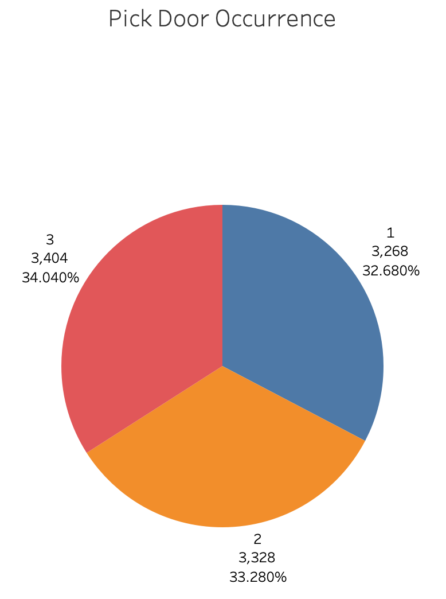
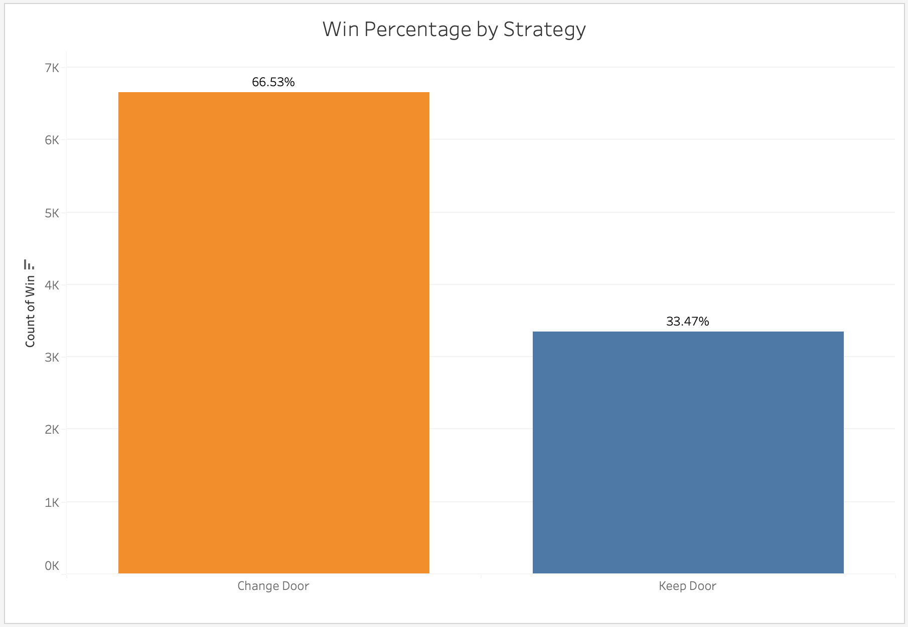
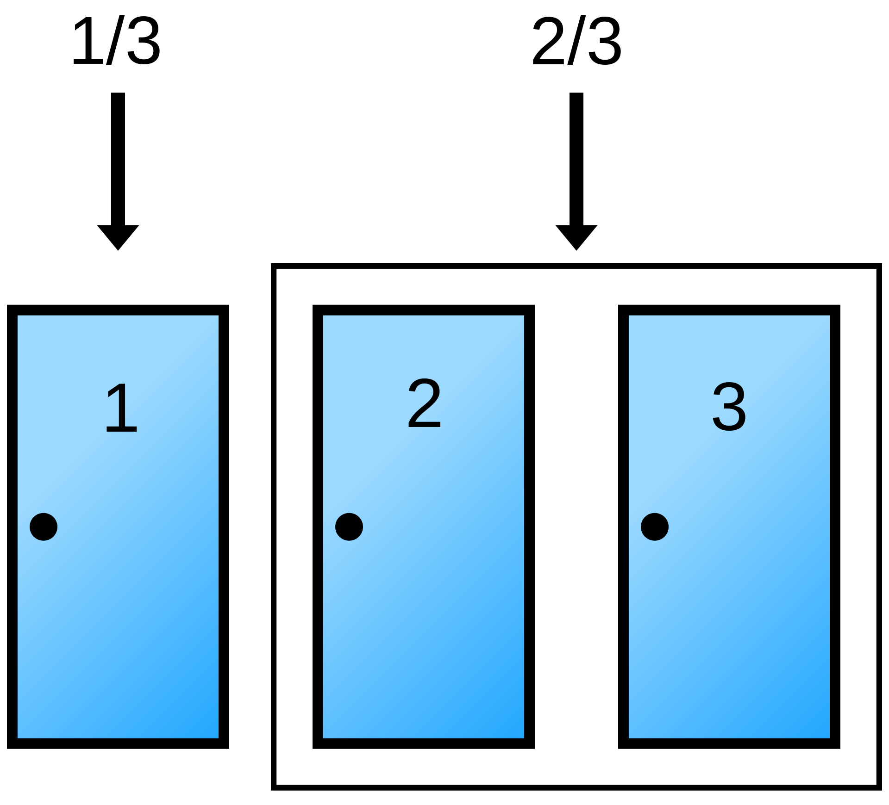
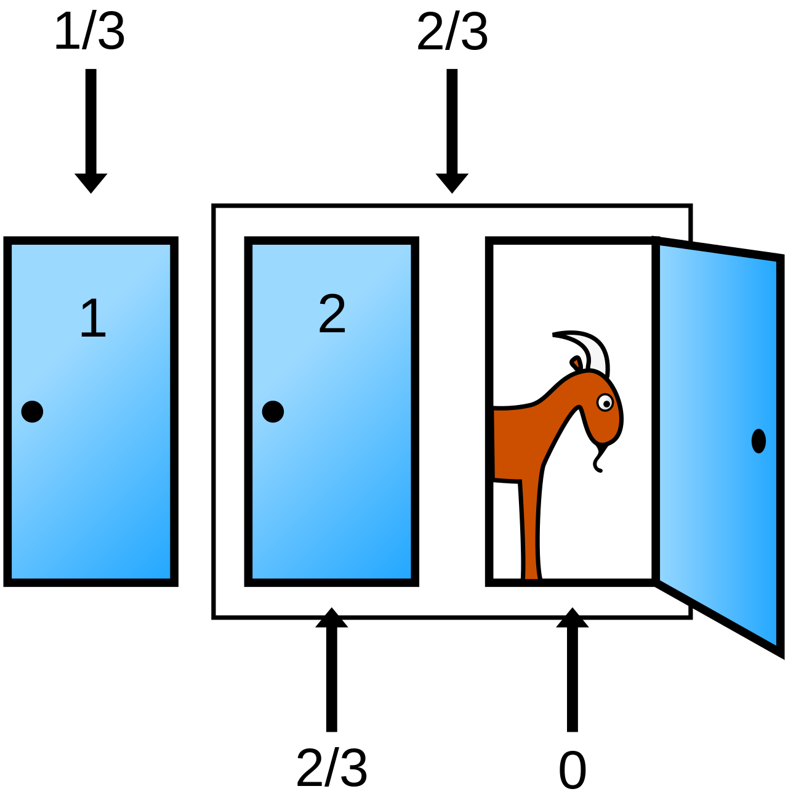

## Monte Hall Simulation

__**Overview:**__

In 'Let's Make a Deal', a classic game show from the 60's and 70's, host Monte Hall would present 3 doors to a contestant.  Behind one of the doors was a car the contestant could win.  Behind the other 2 doors was a goat, meaning the contestant went home empty handed.  Monte would ask the contestant to pick a door.  Once a door was selected, one of the unselected doors was opened, revealing a goat.  The contestant would then have the option to change thier pick or keep thier original door.  The Monte Hall Problem is a statistical thought experiment to determine if it is more beneficial to keep your initial door or change doors.  When I would explain the statistics behind your choice, many people did not believe me.  Due to this, I created this simulator to show them how statistical analysis can imporove thier fortunes.

---

__**Procedure:**__

We will create a Python script to simulate 10,000 games from Let's Make a Deal and then move those games into a Tableau Dashboard.

__**Conclusion:**__

For the interactive Tableau Dashboard for this analysis visit:
[Monte Hall Tableau Dashboard](https://public.tableau.com/app/profile/marc.work/viz/MonteHallProblem/MonteDashboard?publish=yes)

---

---
As you can see in the above Pie Charts, the simulation distributed the Pick and Car doors evenly.
---

The Simulation shows that by changing your door when asked, you are twice as likeley to win the car.  This result is due to the fact that in the beginning of the process, the contestant has a 1 in 3 chance the car is behind the door they chose and a 2 in 3 chance the car is behind a door they didn't choose.

Once Monte opens up one of the doors, the 2 in 3 chance of the car being behind the remaining door they didn't choose gets allocated to the remaining door.

